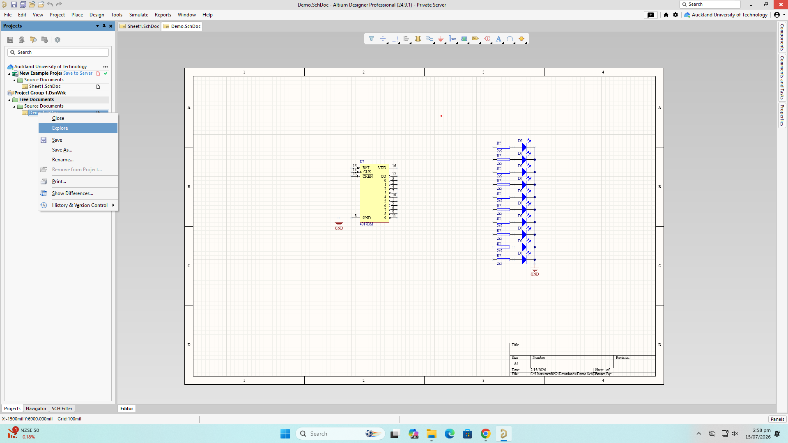
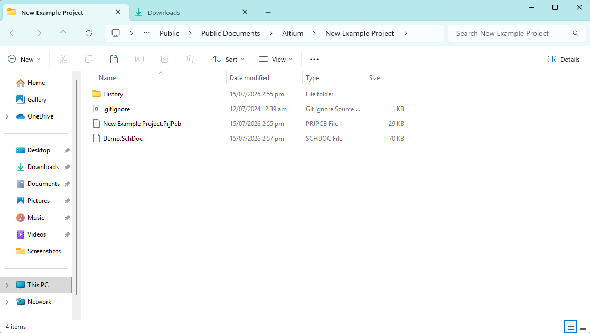
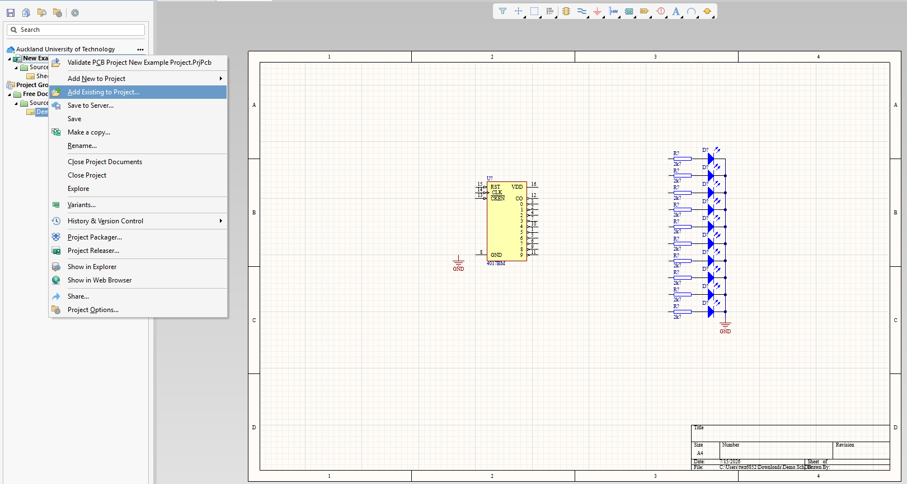
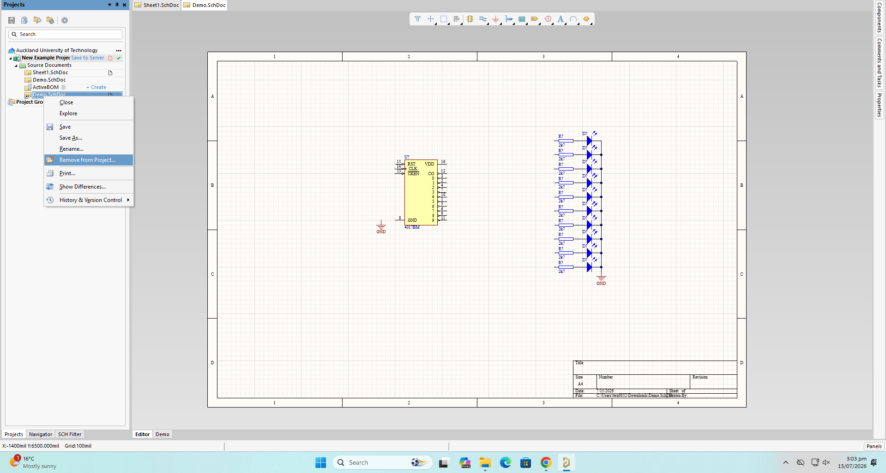
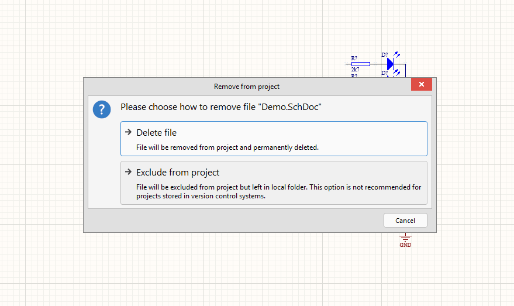
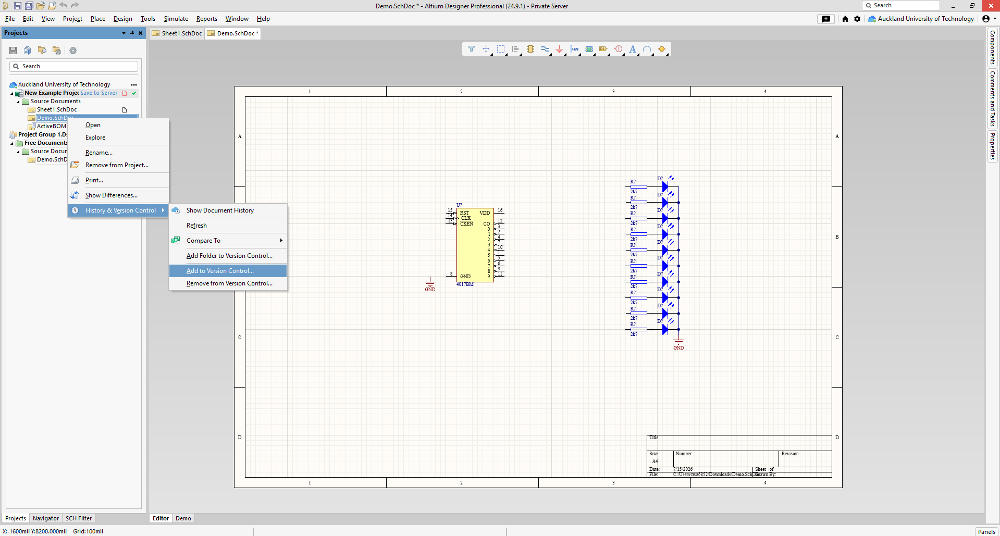
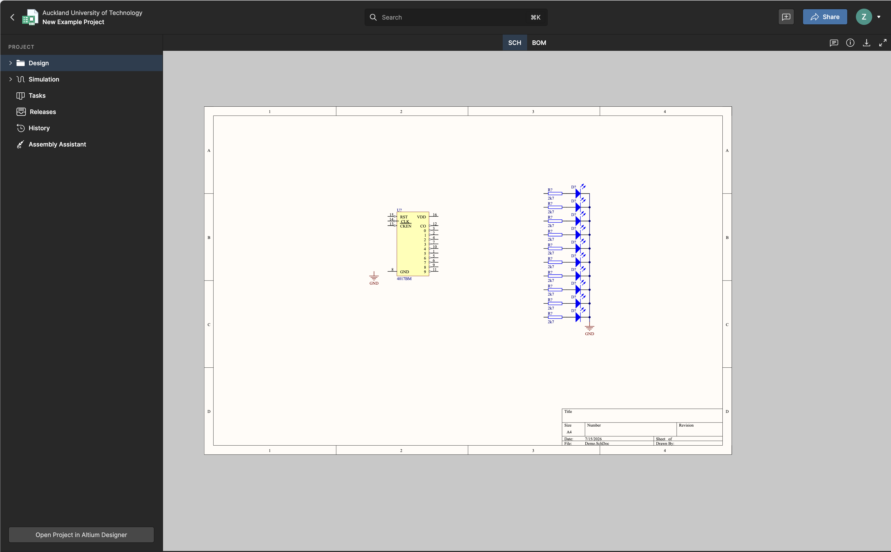

---

::: {.callout-note}
 *To be clear, if you do not know what you are doing, ask a TA.*\
 *We are literally paid to help you.*

That being said, the following are quick guides on solving common problems.
:::

## How to fix the getting kicked off workspace problem

1. Close Altium.
2. Open Altium
3. IMMEDIATELY OPEN COMPONENTS BEFORE ANYTHING ELSE OPENS
4. Reconnect to workspace
5. Login

## How to fix the lastconnection.data error (sometimes)

We do not know why this works, only that it does. Please follow these steps as\
closely as possible.

1. Open the components menu.
2. Click the three horizontal lines (hamburger) button.
3. Select "libraries preferences"
4. Open the "Installed" tab.
5. Select all libraries.
6. Press "remove".
7. Press "Install".
8. Open the [K drive libraries path](<index.html#Altium Libraries Path>).
9. Select all libraries under "Altium Libraries".
10. Press "Open".
11. Close Altium.
12. Reopen Altium
13. Immediately select the components tab
14. Log in.
15. Connect to the AUT workspace.

## How to add an External File in Altium

For a file to be properly included in an Altium project, it must meet three\
criteria:

1. It must be in the correct folder.\
2. It must not be a referenced file.\
3. It must be added to version control.\

You must make sure that any externally added file meets these conditions.

### Moving a file to the correct folder

Once you have your project open, right click on it and select "Explore"



This will open the file explorer location for the project you are working on.

Now, move the file from its original location into the project:



(Demo has been moved from downloads into here)

### Adding the file to the project

Once that is done, right click on the project and click "Add existing to\
project"\



Select the new file, and press "Open".\

Ensure the file icon does not have an arrow on it like this icon: \
If it does, you need to go through the "Add existing to project" step again.\
Then, remove the old referenced file. Ensure you press "Exclude from project"\
instead of deleting it, to make sure that you can recover from mistakes on this\
step.\





Once that is done, add it to version control by right-clicking it, going under\
History and Version Control, and selecting "Add to Version Control"\



### Saving to Server

Finally, right click "Save to Server" next to your project, add a meaningful commit message, and save.

### Checking you have done it correctly

Open up Altium 365 and check your project has the file you added, if not call over a TA.



---

## Altium Libraries Path

This is the path you will use to install the K Drive libraries.

```
K:\WELLESLEY COPY\DESIGN & CREATIVE TECHNOLOGIES\School of Engineering\Electrical & Electronic Engineering\Resources\AltiumLibraries\
```

For projects one and two, you will use `2025S2.IntLib`.

> _Note:_ Do not install libraries from `AltiumLibraries\Altium Libraries` (which is a subfolder of `AltiumLibraries`).
