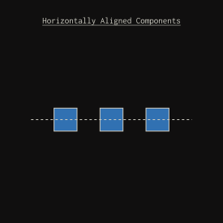
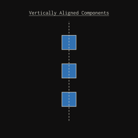
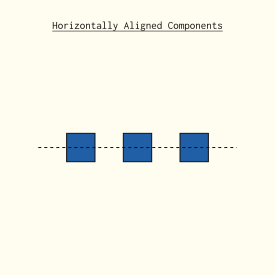
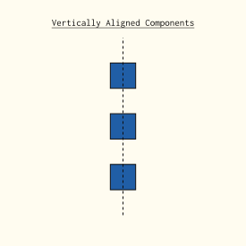

---

## Overview

The midterm test is a closed book assessment, so I can't really say much about
it. That being said, what I *can* tell you, is that it has two parts. The first
is a multi choice questionaire (which is pretty easy), and the second is a timed
PCB routing assessment. You will get ~3.5 hours to route a PCB. Last semester
students were given the schematic file, but before that you had to do the
schematic yourself as well.

I recently tried doing the altium test myself just to see how hard it was and
how long it took. It took me about two and a half hours (including making the
schematic, which took me about 40 minutes). I did not find it particularly hard
knowing what I know now, but I did find it difficult back when I took it as a
student.

## What you should know

While I am not allowed to tell you much about it, here is a list of statements I
_can_ make.

- You will need to construct a board outline that actually cuts out the board at
    the right distance from the edge. You should know how to do that.
- The board you will make is small and dense, get good at routing in tight
    spaces.
- On the smallest track size, it is possible to route between the pads of most
    of the resistors and capacitors.
- This assignment has been basically the same for the past few years.

## What we meen by "horizontally aligned" or "vertically aligned"
::: {.dark-content}

::: {layout-ncol=2}

:::
:::

::: {.light-content}
::: {layout-ncol=2}

:::
:::

This _can be confusing because you use the "align horizontal centers" tool to make
things "vertically aligned" and vice versa. Many people have been confused by
this.