---
For Project 1, you will need to place a mechanical 1 board outline. This was
only clarified in the lab last night, so for those of you who were not there
please follow these instructions.

If you submitted project one before doing this, you will need to resubmit. This
means saving to server again[^2] and submitting another [Smart PDF](./smart-pdf-export.qmd).
If you are out of submissions on canvas you should probably send Michael an email.

## Instructions
1. First, select the mechanical 1 layer.

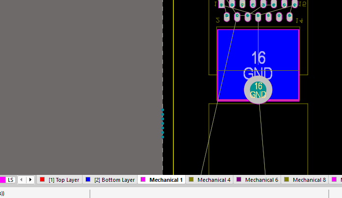

2. In the toolbar at the top, select the line tool.

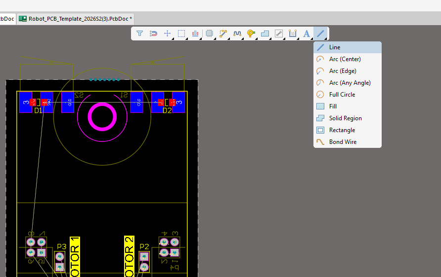

3. Start drawing a line by snapping onto one of the breakaway tab points. [^1]

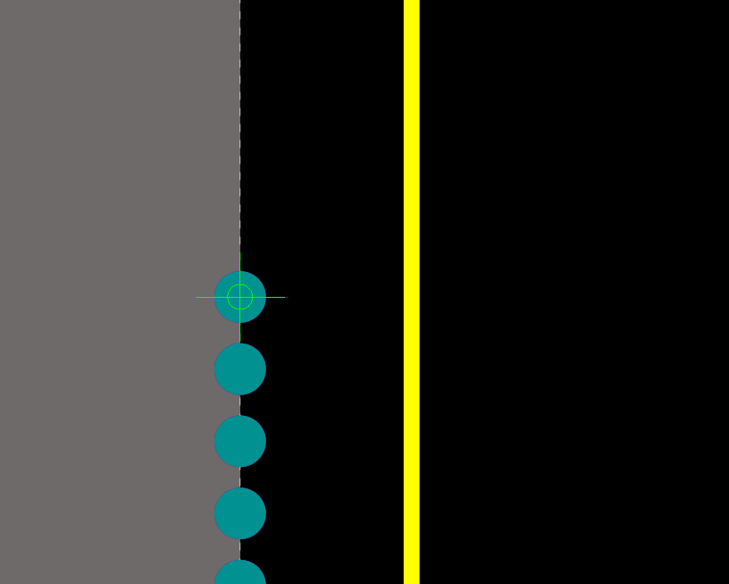

4. Drag it out along the edge to the next breakaway tab point, make sure you make a right angle at the corners of the board

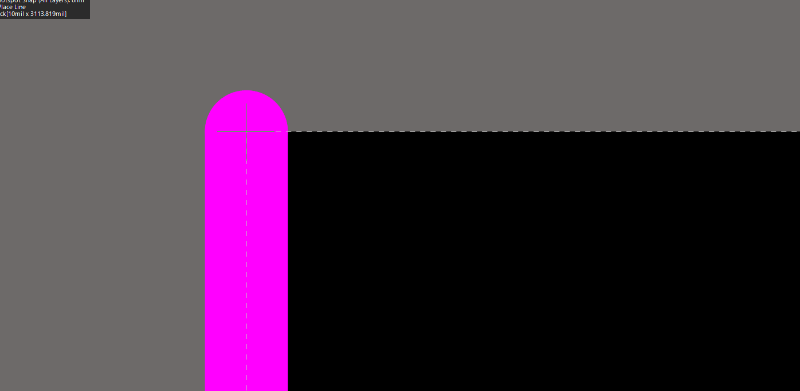

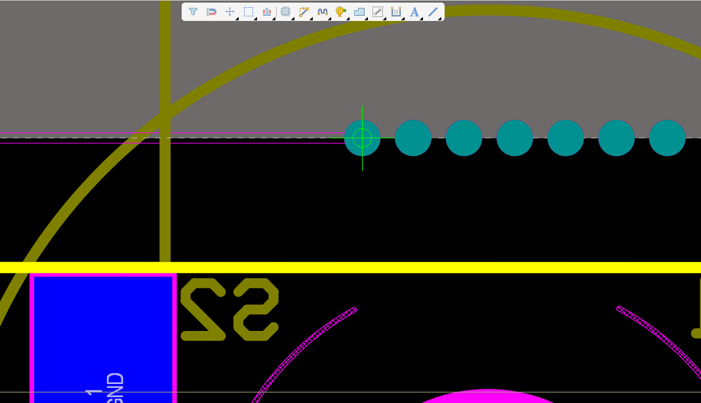

5. Repeat for all edges.

::: {.callout-important}
## DO NOT DO THIS
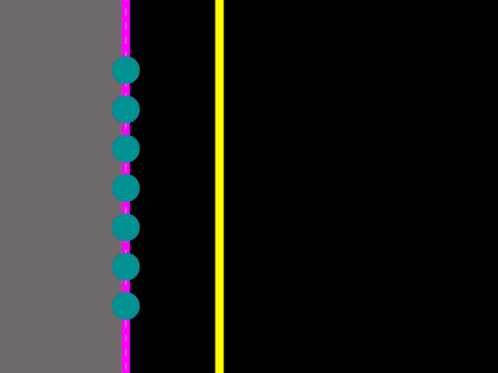{width=50%}
:::
::: {.callout-tip}
## DO THIS INSTEAD
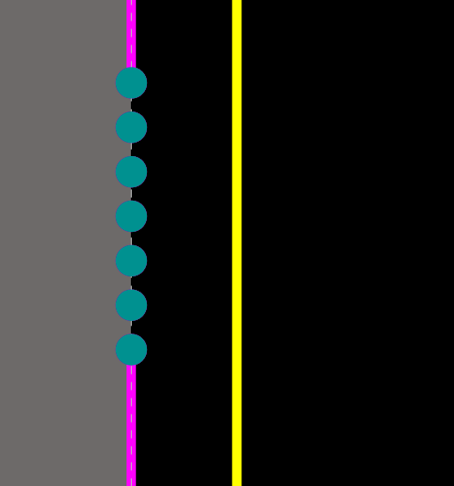{width=50%}
:::

6. Once you are done, you should select all of the lines you just made:

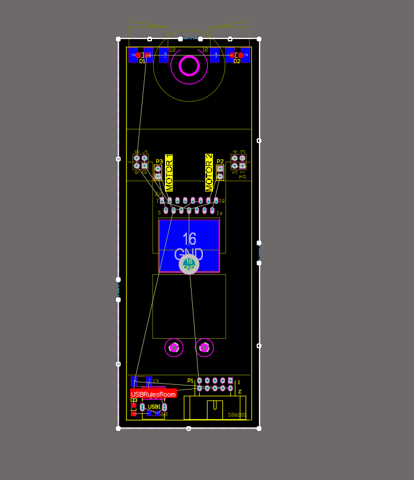

7. Open properties and change the "Width"

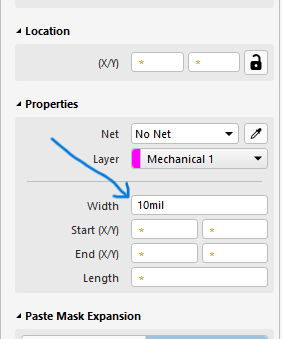

8. Set the thickness to "0.8mm". Not 0.8 mils, 0.8 *millimeters*. You do this by
	putting "mm" after the "0.8" It will automatically convert that to mils for
	you.

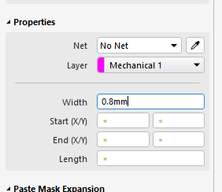
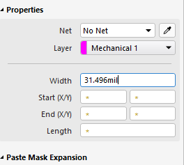

9. Once you do that, your board should look something like this:

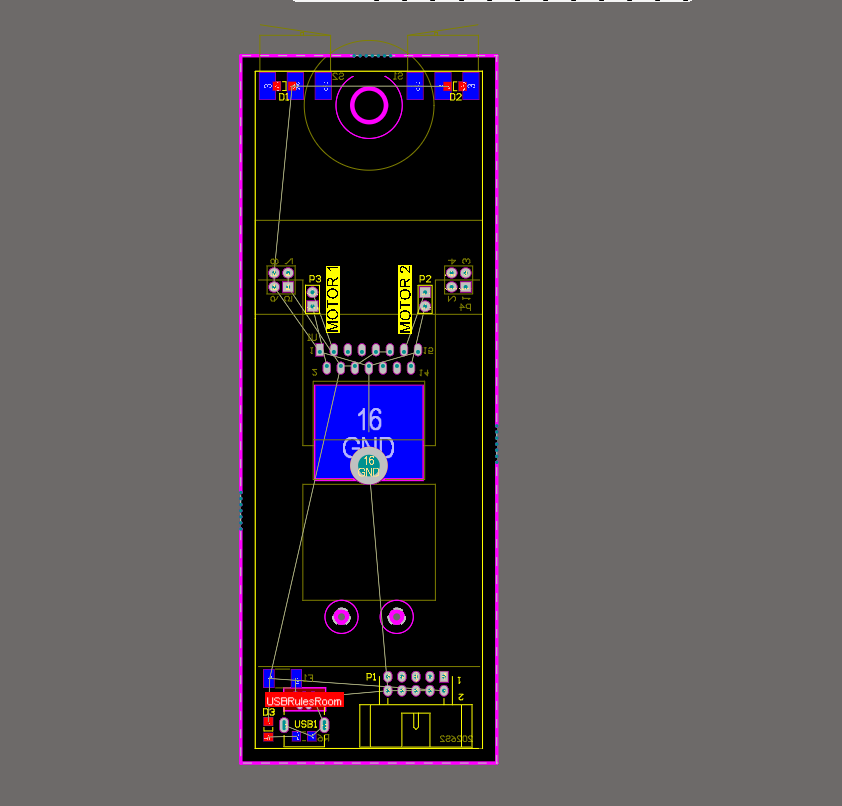

[^1]: Make sure the green circle pops up to indicate you are locking to the breakway point (teal circle)
[^2]: With a commit message like "Hello Michael please mark this one instead" or something.
