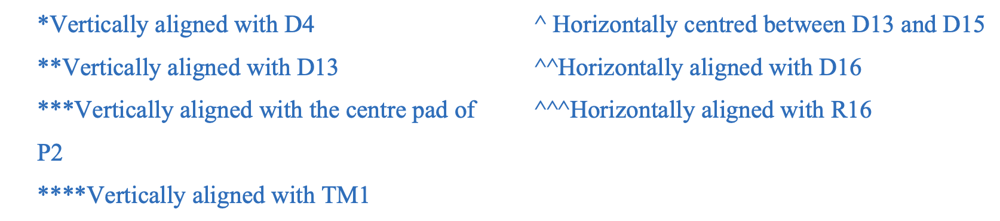

---

::: {.callout-warning}
# Work in Progress
I will add information to this page as time goes on.
Check back later.
:::

## Adding Components to Rooms

## How to arrange relative components

There are certain components in this project you are given coodinates for. For
these, just select the component, open "properties", and set the coordinates
and rotations.
However there are others you are given _relative_ coordinates for. (i.e.
coordinates that depend on the position of other components)

To do this, you can use the align tools. If you place the component at the
right known coordinate, select both components, and use "Right Click
$\rightarrow$ Align" you will get a menu with the alignment tools. In the
example of `D5` and `D4`, you will use the "align vertical centers" option, as
you are trying to align them vertically.

There are two special cases that require consideration here. These are:

1. "^ Horizontally centered between D13 and D15"
	1. Place the component inbetween D13 and D15 at the same height.
	2. Select all three components
	3. Right click any of the three, and go "Align $\rightarrow$ Distribute
	   Horizontally"
2. "\*\*\* Vertically aligned with the centre pad of P2"
	1. Select one of the center pads of P2
	2. Select the component
	3. Right click either the pad or the component, and go "Align
	   $\rightarrow$ Align Vertical Centers"
	4. Click on the center of the component you _don't want to move_ (i.e.
	   the centre pad of P2)

## FAQ

- Q: How do I access `2025S1.IntLib`?
	- *A:* You don't, this is a typo on the document. Use `2026S2.IntLib` as
	described [here](./troubleshooting.qmd#altium-libraries-path).

- Q: Do I need to make a Mechanical-1 outline?
	- *A:* Yes, [but the process is basically the same as for project one.](./P1_mechanical_1_layer.qmd)

