---

For projects one and two, we get you to add a mechanical one layer to a
prexisting board outline. This method is fine for the other two, but for the
[altium test](./Altium Test.qmd) you will need to actually define the board
edge yourself.

We showed you how to do this in one of the first few labs, but its been a while
so here is a quick guide.

## Defining a board outline

Imagine we want to make an 8cm x 8cm board with a 0.80 mm cutting tool diameter. 

::: {.light-content}
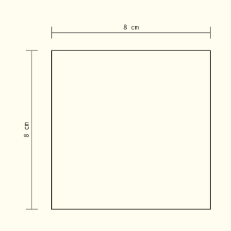
:::

::: {.dark-content }
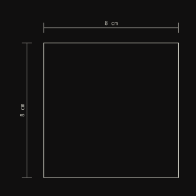
:::

### Step One: Defining the Board Shape

First, we create a rectangle the intended shape and size on the `Keep Out` layer.

::: {.light-content}
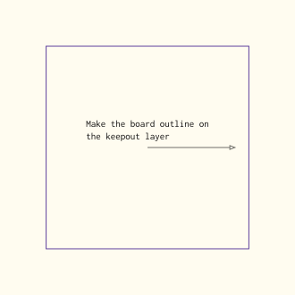
:::

::: {.dark-content }
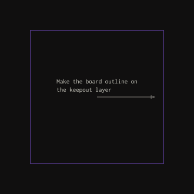
:::

Select it, and use `Design -> Board Shape -> Define Board Shape from Selected Objects`

This will define the shape of the board.

### Step Two: Adding a mechanical One Line

Select *Mechanical 1* and create a line on the board edge

::: {.light-content}
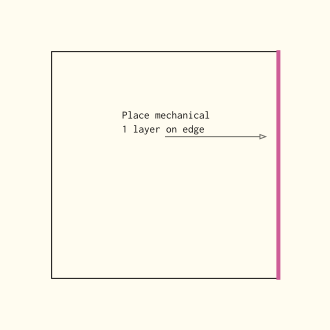
:::

::: {.dark-content }
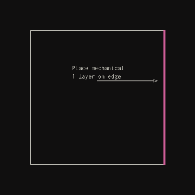
:::

Repeat this for all edges of the board.

### Step Three: Set Mechanical 1 lines to Correct Thickness

Select all  of your `Mechanical 1` lines, open `Properties` [^1], and set
"Width" to whatever the diameter of your cutting tool is (in this case,
0.80mm).

### Step Four: Move out from edge

For each of your new `Mechanical 1` lines you just made, you will need to move
them out so that the _interior_ edge of this line is where you want to cut.

i.e. you need to go from this:

::: {.light-content}

:::

::: {.dark-content }

:::

To this:

::: {.light-content}
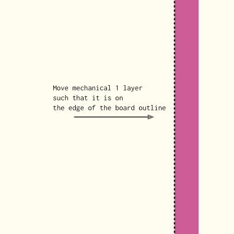
:::

::: {.dark-content }
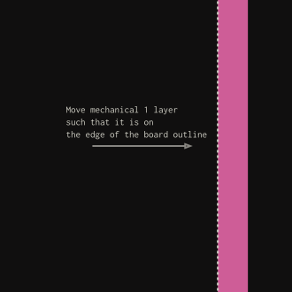
:::

I would recommend doing this by modifying the coordinates. If you select the
line and open `Properties`, you can change either both the start and end x or y
coordinates by *half* the cutting tool diameter.

In the example diagram I showed you, I need to move it *right* by 0.4mm. So I
will *add* 0.4mm to the *x* coordinates.

You can either do the math for that in your head, or you can literally add
`+0.4mm` to the x coordinate boxes. [^2]

If it was on the top of bottom of the board you would add or subtract 0.4mm to
the y coordinates instead.

### Step Five: Extending the Lines

Once you have done that, it will look like this:

::: {.light-content}
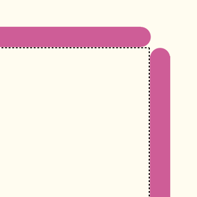
:::

::: {.dark-content }
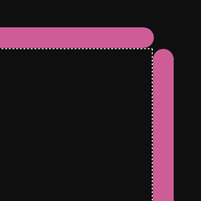
:::

You can connect these together by modifying the other coordinates, or you can click and drag the ends togther. 

::: {.light-content}
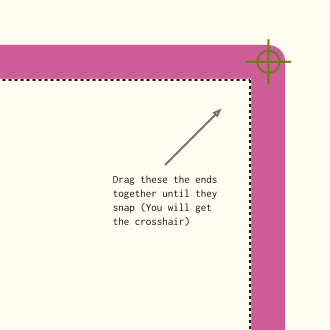
:::

::: {.dark-content }
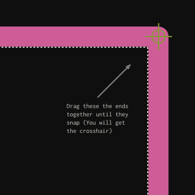
:::

Now you are done.

[^1]: You can do this quickly by pressing `F11`! See
    [here](./keyboard-shortcuts.qmd) for more keyboard shortcuts.

[^2]: So if it was originally like `1000mil` you would change it to
    `1000+0.4mm` and it will automatically update to `1,015.74mil`
