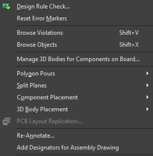

::: {.callout-note collapse=true}
## Shortcut Notation

In altium designer, there are two types of keyboard shortcuts.

I don't know if they have names, but I think of them as being _chords_ and
_riffs_.

You are probably most familiar with chord style keyboard shortcuts, its when you
press multiple keys at the same time to do something. For example, the keyboard
shortcut `CTRL-C` to copy something. You press `CTRL` and `c` at the same time to
trigger it.

In contrast, Altium also has several riff style keyboard shortcuts, which is
where you press a number of keys *in sequence*.
For example, pressing the sequence of keys `t m` in the PCB view resets error
markers.

When I am telling you to press two keys at once, I will put a hyphen between
them (e.g. `CTRL-C`) and when I am telling you to press two keys in sequence I
will put a space btween them (e.g. `j c`)

Generally speaking almost all things you can do through context menus can be
done with this type of keyboard shortcut. When you open one of these menus, you
may notice that most options have one letter that is underlined. Pressing that
letter next will use that option.

For example, in the tools menu pressing `D` will run a design rule check, and
pressing `M` resets error markers.

EDIT: Found out later that Altium refers to these as "Accelerator Keys". Which I
think is a bad name I like my one better.
:::

## In the Schematic Editor.

## In the PCB editor.

### Misc
- Press `3` to enter 3D view [^1]
    - Press `2` to go back to 2D view

- Press `Q` to swap between mils and millimeters.
- Press `G` to change your snap grid size.

### Alignment
- `CTRL-SHIFT-T`: This aligns all components to the top

## In both

The function keys 

[^1]: Did you know that you can move designators around in 3D view? Very useful
    to see where you are putting them more clearly!
