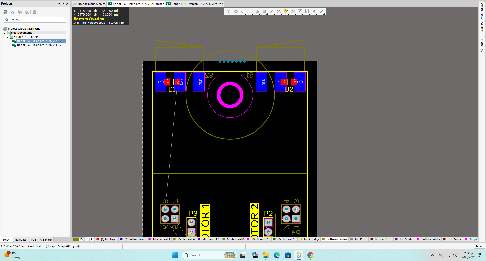
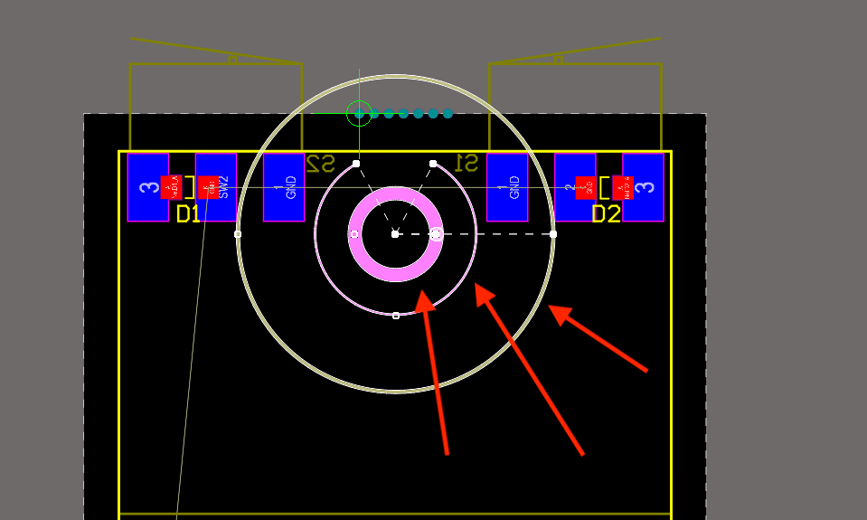
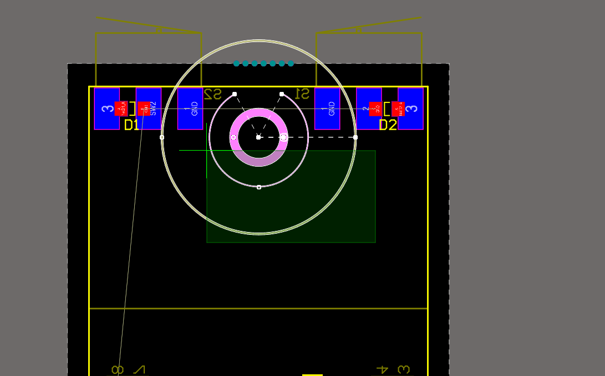
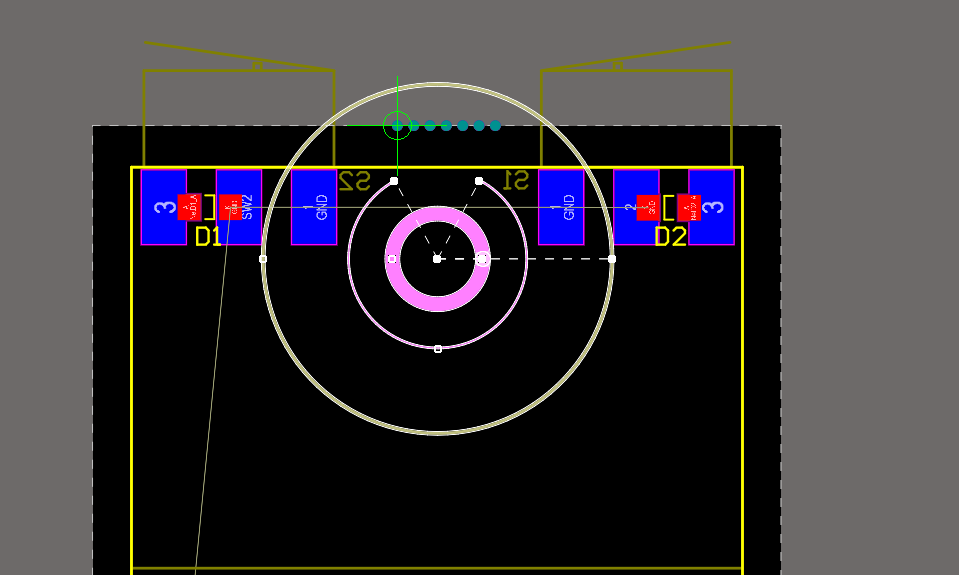
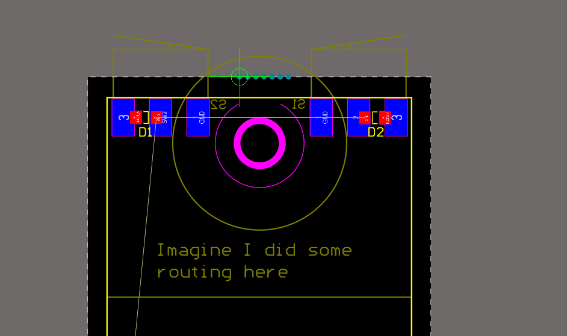

---

There was a mistake with the PCB template and a screw near the top of the
board. You will need to fix this by copying them over from an updated template.
To do so, download the template again from canvas, (same place as last time, on
the [assignment page](https://canvas.aut.ac.nz/courses/23143/assignments/190458)),
and open it in altium as a seperate file.

Then, once you have it open, select the screw parts.\
(Do not select anything else!):

If you drag your cursor up and left it will select anything that *touches* the
box, which makes it easy to select these.

When you press `CTRL-C` to copy it will come up with a crosshair. This is to
select a reference point for the copy paste. Select a known point, I would
recommend the leftmost breakaway tab: (Make sure it comes up with a circle,
that means it is locked on!)

Then, switch over to your board, and press `CTRL-V`, and it will come up with
the same green crosshair. Place it onto the same point and click.

You will need to reroute the section at the top, but it is not too bad.
Please do not try and route tracks over the screw.
Good luck!
