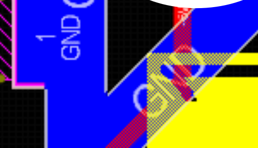
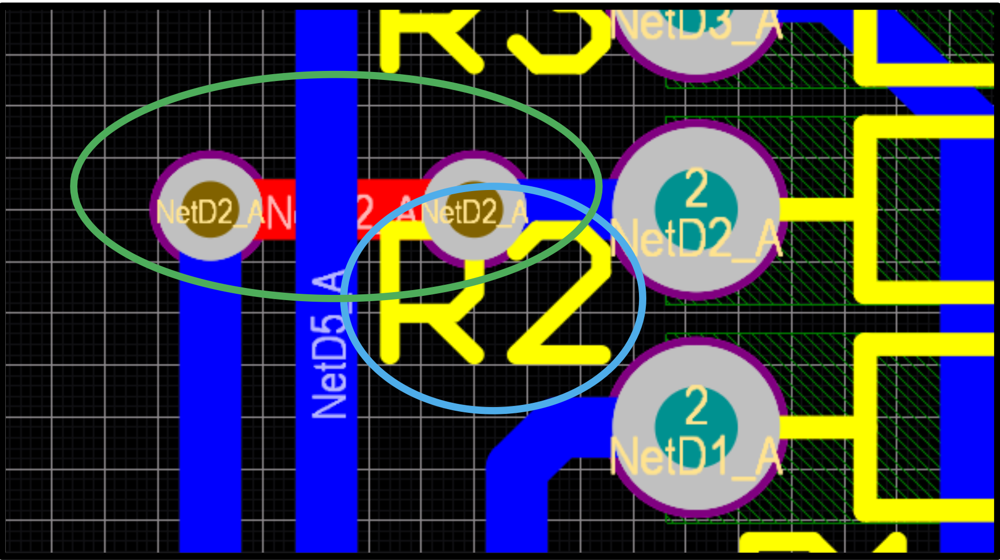
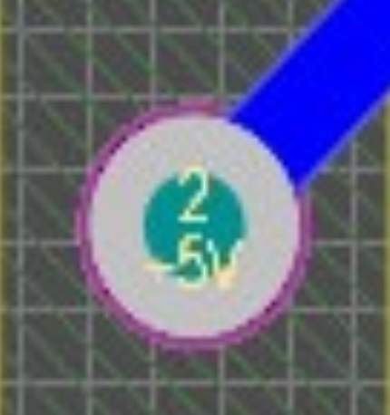
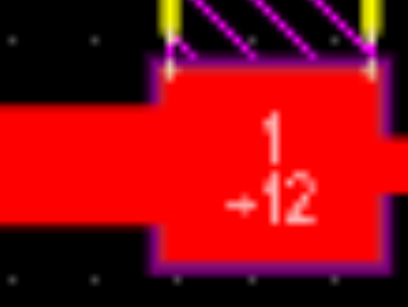
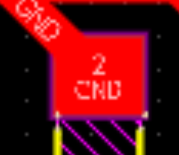

---

::: {.callout-warning}
# Work in progress!
:::

:::{.callout-important}
## Disclaimer
This is not an exhaustive list! There are errors you can make that I am not yet
aware of. This is just a list of errors I can remember and instructions on how
to avoid them. When in doubt, ask Michael or one of the TAs! Sometimes you need to do something kind of bad to avoid doing something worse, and thats ok.

Additionally, many of these are subjective, and this guide represents only my
opinion, not the opinion of the lecturer. When in doubt, ask them.
:::

There are two guiding principles for routing, almost all errors are violating one of these.
All tracks should be **neat** and **as short as possible**.

We want them to be neat for aesthetic reasons, but we want them to be as short
as possible because the longer a track is, the more resistance it has. We can
see this from the formula for resistance:
$$
R = \rho \frac{L}{A} $$
Where:

- $\rho$ is the "resistivity" of the material
- $L$ is the length of the wire
- $A$ is the area of the wire

Because $R \propto L$ ($R$ is proportional to $L$), if we double the length of
the wire, we double its resistance. Because of this, we try to keep any power
tracks as short as possible.

For example, in [project one](./Project One.qmd) we have power lines that can
draw as much as $300mA$. This means that if have a power track with a
resistance of $1 \Omega$ we get a voltage drop across it of $300 mV$.

Therefore, with power lines (such as `+5V` and `GND`), we want to keep them as short as
possible to minimise resistance.

## Functional Guidelines

These are guidelines that affect the functionality of the board.

### Long Tracks

This one matters more for power wires because the voltage drop across a wire
is proportional to current. For most signal lines the current through them is
extremely low, so the resistance doesn't matter too much. 

Generally shorter lines are more efficient, but prioritise making power lines
shorter even if that means using a longer signal line.

### Right Angles

Right angle traces are generally frowned upon. This is because if you have a right
angle, generally speaking you can get a shorter path by taking a diagonal path.

One exception to this is junctions. We prefer a T junction over something like this:

{width=50%}[^1]

### Unnecessary Vias

For both project one and project two you will have a limit to the number of vias you can use.
Avoid using them unnecessarily, for example:

{width=50%}

Only one of the vias in the green circle is necessary as the diode on the right is a through hole component, and as such the top layer track (red) can connect to it directly.

## Aesthetic Guidelines

These are guidelines that are entirely aesthetic preferences. If you violate
these you will probably receive a lower grade, but they shouldn't affect how
functional your board is.

### 45 Degree Pad Connections on Square Pads

With circular pads you can connect to it at either right angles or 45 degree
angles, but with square pads you should only connect to it on one of the flat
sides.

:::{.callout-tip}
## Allowed

{width=50%}

{width=50%}
:::

:::{.callout-important}
## Not Allowed
{width=50%}
:::

### "Squiggles"

The shortest path between two points is a straight line

### Acceptable Angles

[^1]: All images taken from the week 2 slides on canvas.
