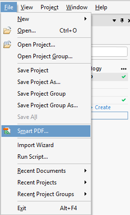
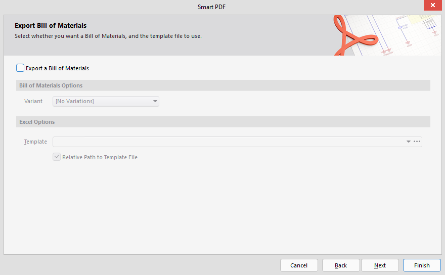
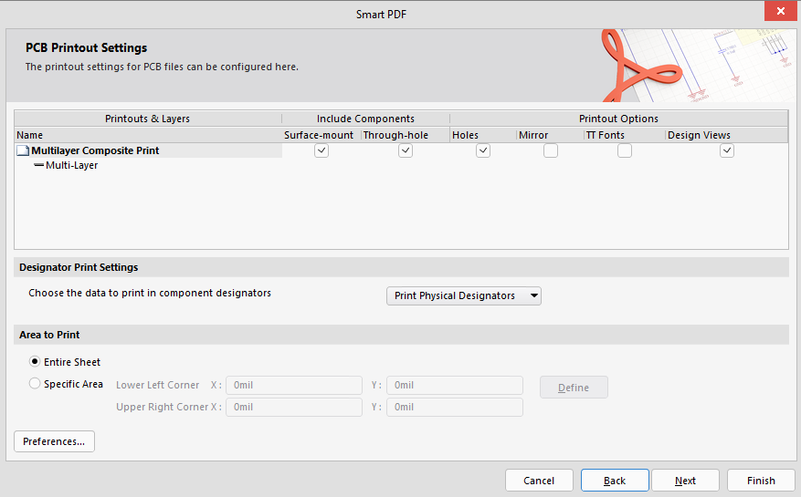
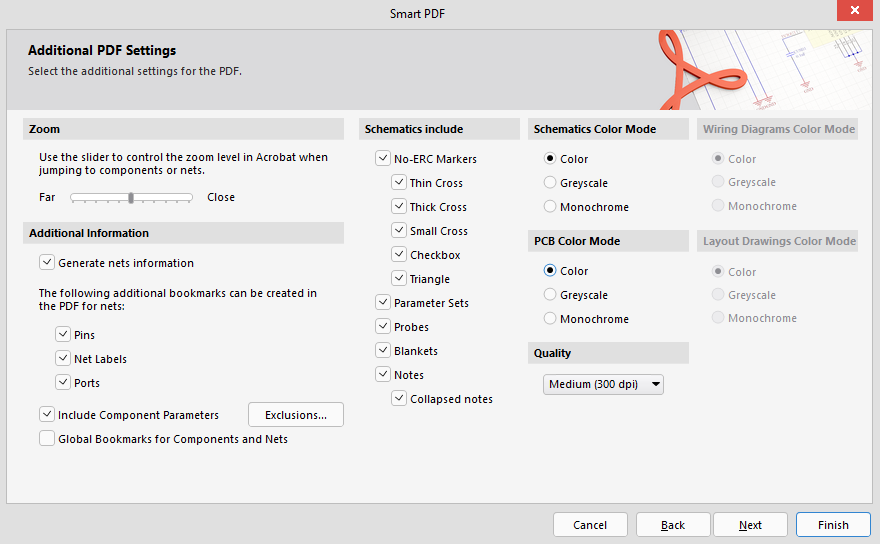
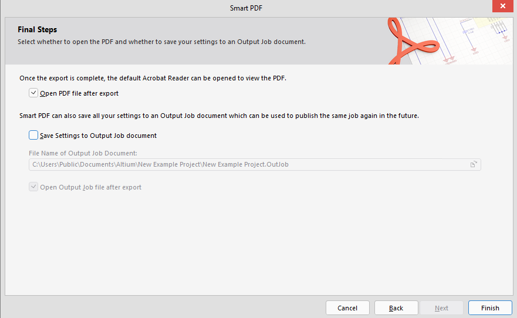

---

To create a _smart PDF_, go to "file" in the top bar, and select "Smart PDF".

Next, press "next" until you get to "Export Bill of Materials" and disable
"Export a Bill of Materials"

In "PCB Printout Settings" enable "Holes".

In "Additional PDF Settings", ensure that the PCB Color Mode is set to "Color".

Nothing needs to be changed for "Structure Settings", just press next.

In "Final Steps" disable "Save Settings to Output Job Document".

Press "Finish".

After a short wait, the Smart PDF will open in the default browser (Edge), click "Save As" in the top
right corner, and save it somewhere you know how to get to (such as the
desktop).

This is the document you will upload to canvas when you submit altium designs (such as projects one and two, and the midterm assessment)
