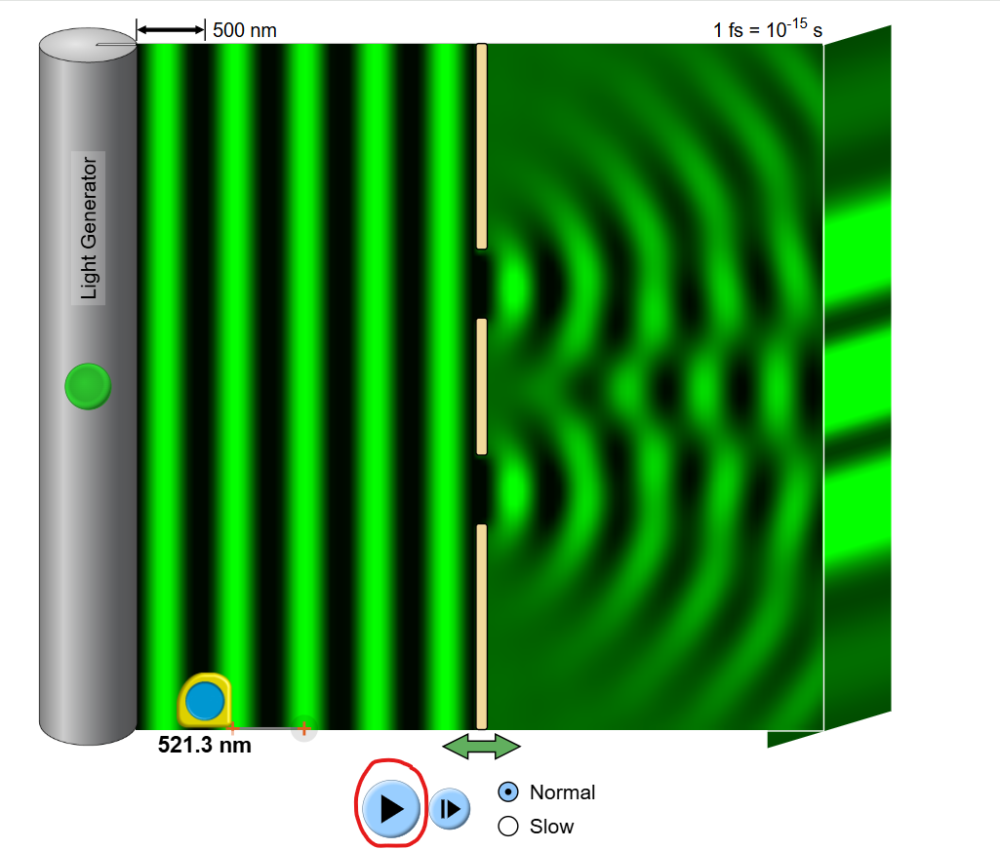
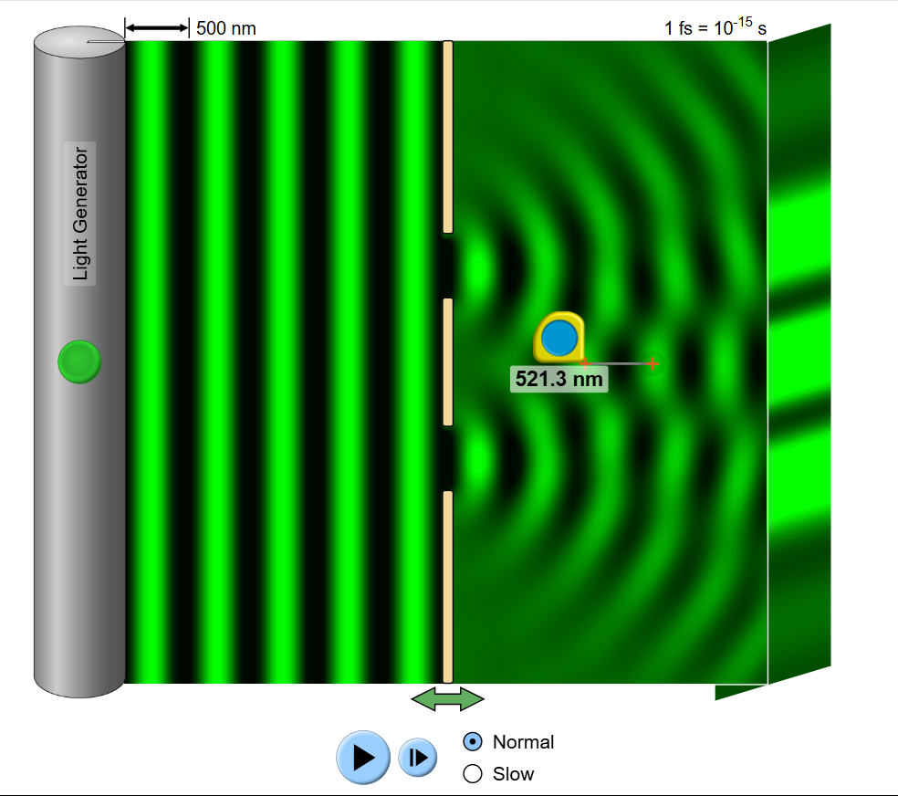
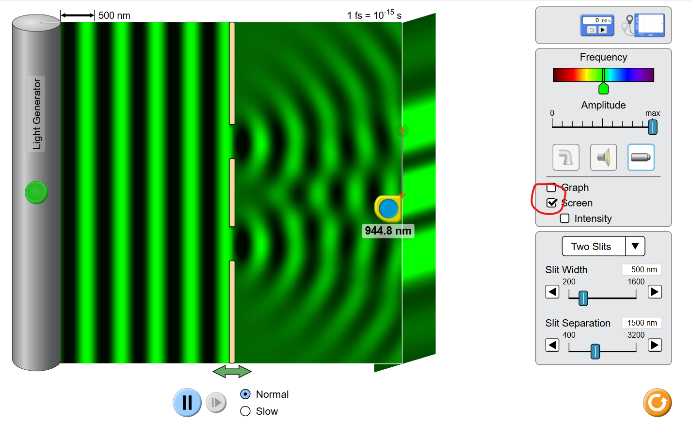
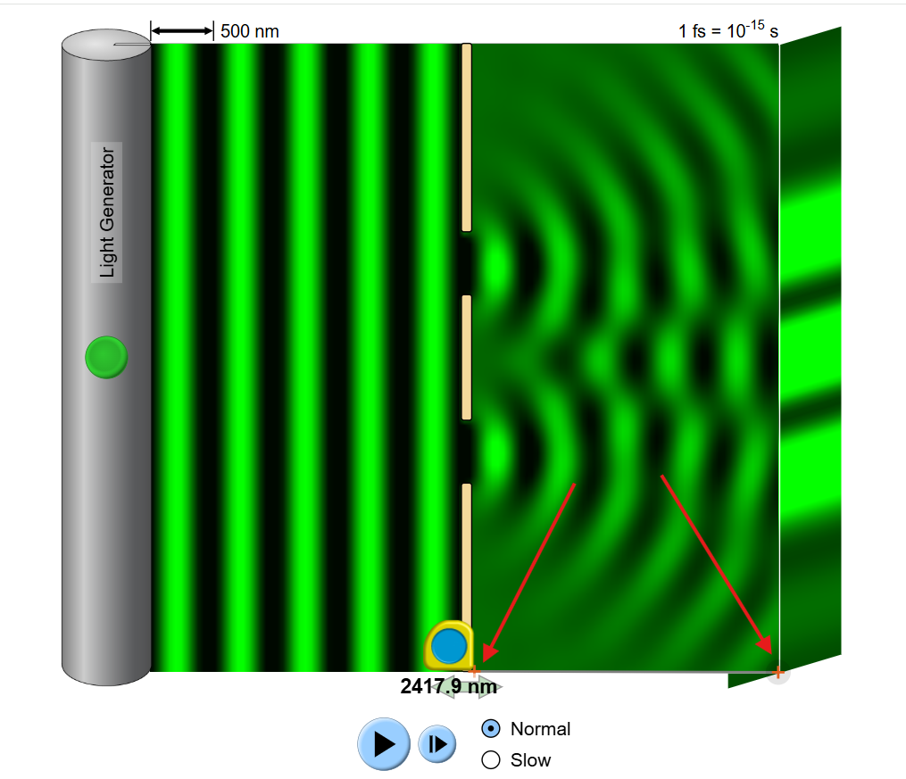

<!-- ::: {.callout-note} -->
<!-- ## Assessment Information -->
<!---->
<!-- Due: Week 3 -->
<!-- ::: -->

---

::: {.callout-warning}
## Disclaimer
This document is intended to be a supplement to the lab brief, not a
replacement for it. If someone in here contradicts what you have been told by
David or something in the lab brief, trust them not me.

:::

The simulator we are using can be found
[here](https://phet.colorado.edu/en/simulation/wave-interference).

## Taking Measurements

### Measuring Wavelength (λ)

To measure the wavelength, pause the simulation using the pause button

Then, place the measuring tool between the *centers* of two waves on the left.
Ideally do this along the bottom edge of the screen to make sure you don't do
it at an angle. For the default green light this should be roughly 510 - 520 nm.

You could in principle use the waves on the right, but they are less clearly
defined. You will get a better measurement if you use the ones on the left.

### Measuring the distance between the bright spots (x)

To measure the distance between the bright spots, enable the "screen" using the
checkbox on the right, and then take the distance between the center of the
central bright spot, and the center of one of the adjacent bright spots. [^1]

### Measuring Slit Separation (d)

You do not need to measure this using the measuring tool, just read it off the
box on the right.

### Measuring screen distance (L)

Use the measuring tool between the **RIGHT** side of the slits and the **LEFT**
side of the screen.

As before, measure along the bottom edge of the simulation to avoid measuring
it at an angle

## Calculating Error

As part of this assessment you are asked to calculate the error
between each of your measurements and their calculated value

This is done using the formula:
$$
\%\text{ERROR} = \left| \frac{ \text{calculated} - \text{measured}}{\text{measured}}\right|\times 100
$$

So, for example, if you calculate a wavelength of $500 \space nm$, but measure
a wavelength of $510\space nm$, the error would be:

$$
\% \text{ERROR} = \left|\frac{ 500 - 510 }{510}\right| \times 100 \Rightarrow \left|\frac{-10}{510} \right|\times 100 = \boxed{1.961 \%}
$$

Reminder: Error does not have units (if I included the units in my calculation they would have immediately cancelled), so don't give the error as something like "1.961% nm"

## Misc

Some advice:

- Read the lab brief carefully.
- Always include units.
- I would recommend rounding to 4 significant figures for this lab.

[^1]: It does not matter if you use the top or bottom one, the answer should be
	the same.
